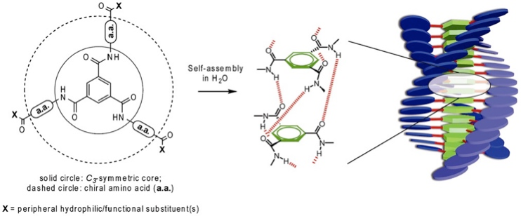

# mag_self_assembly

Calculate the energy of a supramolecular assembly under applied magnetic fields.

This repository consists of magnetic energy and field calculations used for a
paper on [Magnetic Control over the Topology of Supramolecular Rod Networks](https://doi.org/10.26434/chemrxiv.12762269.v1)
, based on the change of length and structure of Gd(III)-DOTA-BTA
supramolecular assemblies.

The first notebook [Magnetic_Energy_Assemblies](notebooks/Magnetic_Energy_Assemblies.ipynb),
provides a Monomer class for analytically calculating energies and critical
lengths for supramolecular assemblies with different caged paramagnetic ions.

The second notebook [Self-Consistent](notebooks/Self-Consistent.ipynb),
provides a self-consistent approach to summing up the magnetic interactions of
each dipole moment under an external field, recalculating the induced magnetic
moments, and thus calculating the total energy of the assembly.

Two additional notebooks demonstrate inefficient methods to achieve the same
goal, based on the rotation of magnetic moments. The first,
[Macrospin_Approximation](notebooks/Macrospin_Approximation.ipynb), assumes a
single macrospin, with all moments aligned, and minimises the energy by
rotating a single (<!-- $\theta$ --> , <!-- $\phi$ --> ) tuple. The second,
[Global_Optimisation](notebooks/Global_Optimisation.ipynb), performs a global
optimisation by freely rotating the all moments.

## 1. DOTA-BTA Structure

The DOTA-BTA monomers stack in a chiral structure, with

[1] P. Besenius, G. Portale, P. H. H. Bomans, H. M. Janssen, A. R. A. Palmans, and E. W. Meijer, _Controlling the Growth and Shape of Chiral Supramolecular Polymers in Water_, PNAS **107**, 17888 (2010).

## 2. Magnetic Energy Calculations

The energy of an induced paramagnetic magnetic moment in an external field is

At room temperature, local dipolar fields, and exchange interactions from neighbouring rare earth atoms in a DOTA-BTA assembly are negligible. The former is confirmed with detailed calculations elaborated below, and the latter from SQUID magnetometry, which showed an exchange interaction of -0.7 K (see [main text](https://doi.org/10.26434/chemrxiv.12762269.v1)). Furthermore, we can assume a linear Curie law dependence of these atomic moments for an applied magnetic field $\mathbf{B}$, giving an effective atomic moment, , in units of Bohr magneton, .

where <!-- $m_{atom}$ -->  is the 0 K atomic moment also in units of . In this scheme, **m** is always collinear with **B**, and the magnetic energy of a monomer, with three rare earth atoms is thus

We define a critical length $L_c$, as the minimum length where the magnitude of the magnetic energy of an assembly is sufficient to equal or overcome thermal energy:

where _d_ is the inter-layer spacing, and the critical monomer number  is . Alternatively, the critical length can be written as

%5E2)

To generate the table below, we take _d_ = 0.35 nm, _B_ = 2 T, and _T_ = 298 K. 

| Ion                              |           _m_ | _m__eff_ |  _U__m_ |               _dG_ | _L__c_ | _N__c_ |
| :------------------------------- | ------------: | ------------------: | -----------------: | -----------------: | ----------------: | ----------------: |
|                                  | µB |                   % | J mol-1 | J mol-1 |                nm |                   |
| Ti3+, V4+  |           1.7 |                0.26 |              -0.07 |              -0.04 |             11918 |             34052 |
| Ti2+, V3+  |           2.8 |                0.42 |               -0.2 |               -0.1 |              4393 |             12553 |
| V2+, Cr3+  |           3.8 |                0.57 |              -0.36 |              -0.18 |              2385 |              6816 |
| Cr2+, Mn3+ |           4.9 |                0.74 |               -0.6 |               -0.3 |              1435 |              4099 |
| Mn2+, Fe3+ |           5.9 |                0.89 |              -0.88 |              -0.44 |               989 |              2828 |
| Fe2+, Co3+ |           5.4 |                0.81 |              -0.73 |              -0.37 |              1181 |              3375 |
| Co2+, Ni3+ |           4.8 |                0.72 |              -0.58 |              -0.29 |              1495 |              4272 |
| Ni2+                  |           3.2 |                0.48 |              -0.26 |              -0.13 |              3364 |              9611 |
| Cu2+                  |           1.9 |                0.29 |              -0.09 |              -0.05 |              9541 |             27261 |
| Ce3+                  |           2.5 |                0.38 |              -0.16 |              -0.08 |              5511 |             15746 |
| Pr3+                  |           3.5 |                0.53 |              -0.31 |              -0.15 |              2812 |              8034 |
| Nd3+                  |           3.4 |                0.51 |              -0.29 |              -0.15 |              2980 |              8513 |
| Sm3+                  |           1.7 |                0.26 |              -0.07 |              -0.04 |             11918 |             34052 |
| Eu3+                  |           3.4 |                0.51 |              -0.29 |              -0.15 |              2980 |              8513 |
| Gd3+                  |           8.9 |                1.34 |              -1.99 |                 -1 |               435 |              1243 |
| Tb3+                  |           9.8 |                1.47 |              -2.42 |              -1.21 |               359 |              1025 |
| Dy3+                  |          10.6 |                1.59 |              -2.83 |              -1.41 |               307 |               876 |
| Ho3+                  |          10.4 |                1.56 |              -2.72 |              -1.36 |               318 |               910 |
| Er3+                  |           9.5 |                1.43 |              -2.27 |              -1.14 |               382 |              1091 |
| Tm3+                  |           7.6 |                1.14 |              -1.45 |              -0.73 |               596 |              1704 |
| Yb3+                  |           4.5 |                0.68 |              -0.51 |              -0.25 |              1701 |              4860 |

## 3. Magnetic Dipole Calculations

### Self-Consistent Method

To ensure that, at room temperature, the local dipolar fields play no role in
the arrangement of the magnetic moments, we calculate the magnetic ground state
for a magnetic assembly of length <!-- $N_m$ -->  in an external magnetic field using a
lattice sum approach:

1. Impose an external field

2. Generate the positions of each rare earth atom in the BTA assemblies:
knowing that in a single monomer those positions are %20%3D%20(0%2Cr%2C0)),
), and
) where _r_ = 2.25 nm,
that the stacking distance between monomers is _d_ = 0.35 nm, and that there is
a helicity of 10˚ rotation per layer, which for the ith atom of the
jth layer is:

3. Calculate each local dipole moment using either a Curie-Law or Brillouin
function (at _T_ = 298 K the difference is negligible) giving and array of
.

4. At each atomic site, calculate the dipolar field due to all other moments in
the assembly using

%20%3D%20%5Cfrac%7B%5Cmu_0%7D%7B4%5Cpi%7D%20%5Cleft%5B%5Cfrac%7B3%20%5Cmathbf%7Bm%7D%0A%20%20%20%20(%5Cmathbf%7Bm%7D%20%5Ccdot%20%5Cmathbf%7B%5Chat%7Br%7D%7D%20)%20%7D%20%7Br%5E5%7D%20-%20%5Cfrac%7B%5Cmathbf%7Bm%7D%7D%20%7Br%5E3%7D%5Cright%5D)

which is the magnetic field at a point in space due to a magnetic dipole,
resulting in a matrix

5. At each atomic site sum the external and dipole fields 

6. Calculate a new moment m_new at each site using the local 

7. Calculate the mean L2 norm for the difference between the updated and old moment vectors at each site
%5E2%20%5Crightarrow%200)

8. Repeat 3 – 7 with updated total field and moments until  threshold

Other minimisation approaches are possible, such as by fixing the magnitude of
the magnetic moments, and minimising the energy cost function through a free
rotation of each moment. A first, simpler cost function, takes a macro-spin
approach, assigning one polar (<!-- $\theta$ --> ) – azimuthal (<!-- $\phi$ --> ) angle pair, with all atomic
moments rotating coherently, which is minimised using the L-BFGS-B algorithm.
The second allows the free rotation of each moment using basin hopping global
optimisation, with L-BFGS-B as the local optimiser. However, both approaches
are slower than the L2 norm method presented above, particularly the global
optimization method.

### TODO

1. Change functions to accept dictionaries or unwrap \*\*kwargs instead.
